___
# Manuale Utente
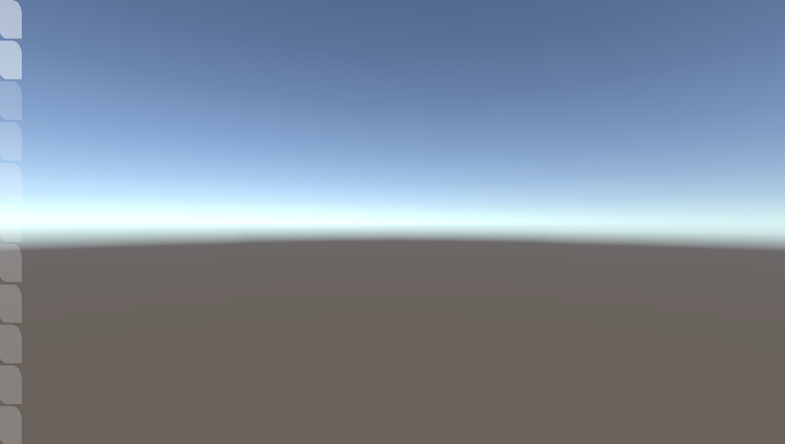

Per iniziare l utente deve premere una delle TAB evidenziate, è possibile spostare la telecamera attorno al punto 0,0,0 tenendo premuto con il tasto destro del mouse e spostando il mouse.

## World Settings
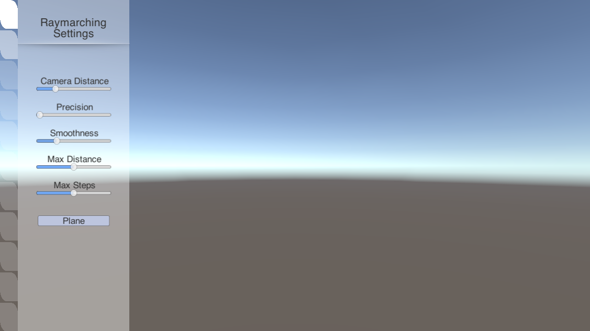
 
Valori legati alla tecnica di raymarching della scena

* **Camera Distance**: distanza della camera dal punto 0,0,0 del mondo.

* **Precision**, cioè la precisione dell'algoritmo a delineare i bordi della forma.

* **Smoothness**: determina il grado di smoothness degli operatori, quanto viene arrotondato il bordo in cui due figure interagiscono.

* **Max Distance**: fino a quanto lontano può arrivare il raggio, definisce la distanza massima degli oggetti renderizzati, quindi oggetti troppo lontani non vengono renderizzati 

* **Max Steps**: quanto l'algoritmo può far avanzare il raggio

* **Plane**: crea un piano orizzontale sul punto 0,0,0 

## Block Settings
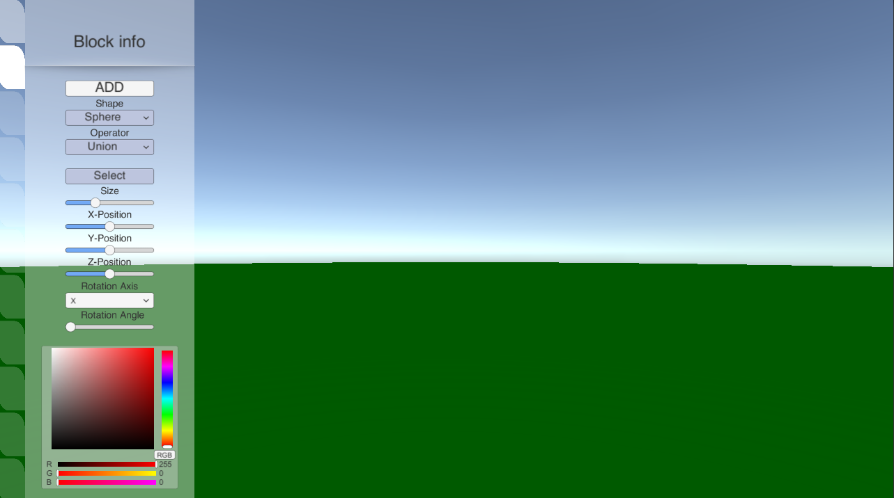
 
* **ADD**: Premendo ADD viene generata una figura di default nel punto 0,0,0, di forma sferica di colore rosso 

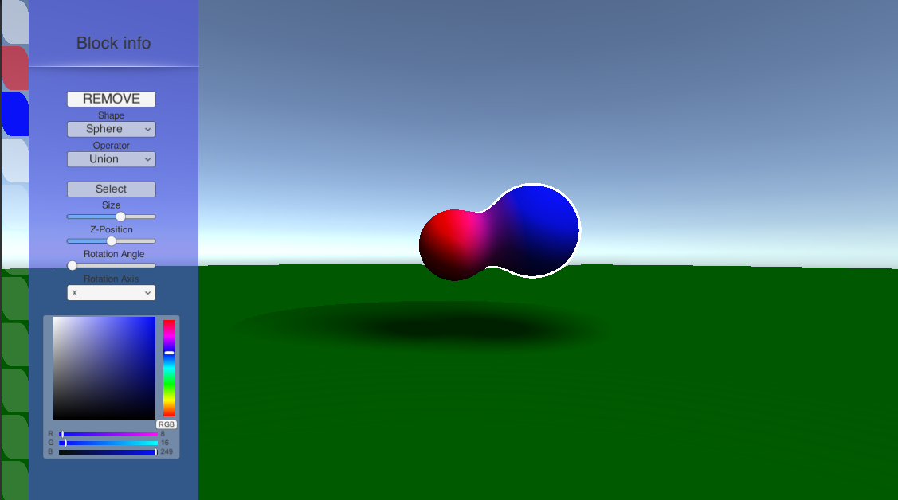
 
* **REMOVE**: Premendo REMOVE la figura viene rimossa dalla scena e con lei le impostazioni di quella figura

* **Shape**: dalla tendina è possibile modificare la forma della figura a schermo, da sfera a cubo a toro. 

* **Operator**: dalla tendina è possibile modificare l operatore  con la quale la figura interagisce con le altre. 
    * **Union** le figure si uniscono tra loro 
    * **Subtraction** la figura sovrapposta elimina la parte sovrapposta sull'altra figura.
    * **Intersection** il risultato della scena è la sovrapposizione di tutte le figure nella scena, quindi l'intersezione tra le figure. 

* **Select**: pulsante che applica un outline sulla figura nella scena per evidenziarla dagli altri 

* **Size**: permette di scegliere la dimensione della figura

* **Z-Position**: permette di definire la profondità nello spazio

* **Rotation Angle**: permette di definire l angolo di rotazione della figura sull asse di rotazione scelta

* **Rotation Axis**: permette di definire mediante le opzioni nella tendina l'asse su cui applicare la rotazione su quella figura 

* **Color**: si può definire quale colore usare sulla figura 

* Si può spostare la figura cliccandola con il tasto sinistro del mouse facendo drag and drop. 
___

# Teoria

## Raymarching
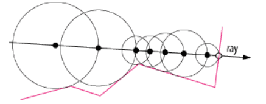

Il raymarching è una tecnica che permette di gestire la grafica implicita, cioè in cui non ci sono modelli o figure e viene tutto calcolato al momento basandosi sulle informazioni nel mondo. 

Questa tecnica consiste nel generare un raggio per ogni pixel a schermo, farlo marciare fino a quando viene rilevato un punto in prossimità (definita dalla precisione) dal punto del raggio che marcia.

## Algoritmo 

```
RM Raymarching(float3 ro, float3 rd, float depth)
{
    const int max_iteration = _maxIterations;
    float t = 0; //distance travelled along the ray dir

    Hit hit;

    for (int i = 0; i < max_iteration; i++)
    {
        float3 p = ro + rd * t; //position
        hit = distanceField(p); //check in distancefield
        t += hit.dist;

        if (t > _maxDistance || t >= depth || hit.dist < _accuracy)
            break;
    }

    RM result;
    result.travel = t;
    result.hit = hit;
    return result;
}
```

L'algoritmo è molto semplice, si prende un punto nello spazio detto Ray Origin (ro) dalla quale il raggio parte, mediante Ray Direction (rd) viene definita l'angolazione di questo raggio (per colpire l'ennesimo pixel a schermo). 

Fino a quando il raggio non supera le iterazioni massime 
consentite, viene controllata la punta del raggio, 
dove t è una quantità che definisce quanto ha marciato il raggio: 
> punta del raggio  = ro + rd * t

Si controlla mediante le funzioni di distanza, quanto questa punta del raggio è vicina ad una superficie. 

L'algoritmo termina quando la punta è abbastanza vicina alla superficie, cioè la distanza tra punta e superficie è minore di un valore fornito detto precisione (_accuracy), oppure il raggio ha marciato troppo superando la profondità o la distanza massima fissata. 

Nel primo caso viene definito e colorato il punto di contatto, quindi il punto sulla superficie sempre definito con: 
> punto = origine (ro) + direzione (rd) * viaggio (t)

Nel secondo caso il raggio non ha incontrato nulla e deve mostrare lo sfondo della scena

## Valori chiave
* Precisione
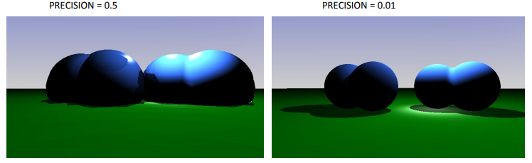

Il valore indica la precisione della figura rappresentata, un valore molto piccolo implica più precisione. 
* Distanza
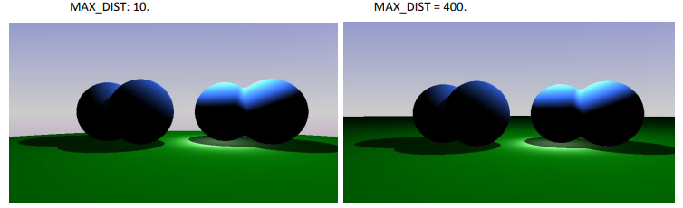

La distanza serve per definire un limite sul percorso del raggio, cioè quanto un raggio può marciare prima di trovare una figura. Questo implica che le figure poste più lontano non possono essere mostrate in quanto non raggiunte dal raggio.

* Steps
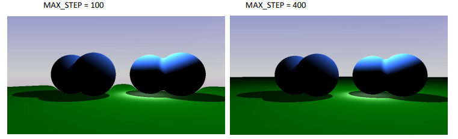

Un valore piccolo implica imprecisione dell'immagine, soprattutto su oggetti posti dietro ad altri che si deformano (il piano nell'immagine). Più è alto il valore di step, maggiore è la computazione necessaria. 

## Figure o Primitive 
### Piano 
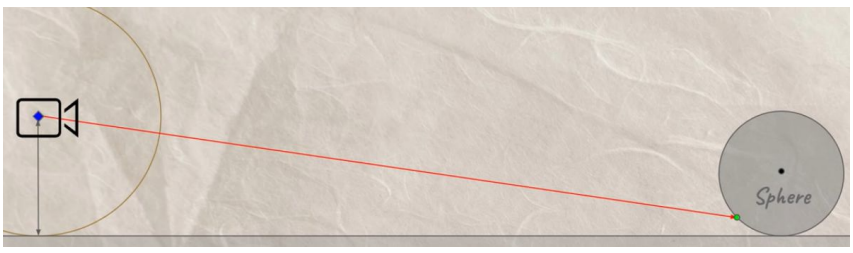
```
float df_plane (vec3 rayPos)
    return 2+rayPos.y;
```
La distanza dal piano è la distanza dal componente y del raggio + 2, quindi il piano è sempre posizionato a 0, -2, 0

### Sfera

```
float df_Sphere(vec3 rayPos, vec3 spherePos, float size)
    return length(rayPos - spherePos) - size;
```
La distanza dalla superficie di una sfera è banalmente la distanza tra la punta del raggio e il centro, meno il raggio della sfera. 

### Cubo

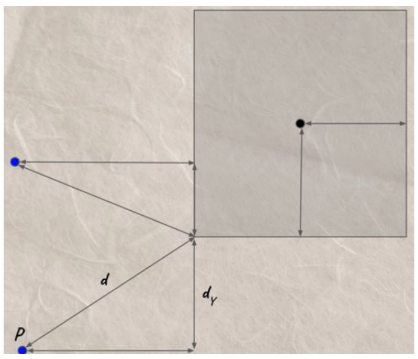
```
float df_Box(vec3 rayPos, vec3 pos, float s )
{
    pos = rayPos - pos;
    vec3 size = vec3(s);
    vec3 d = abs(pos) - size;
    float dist = length(max(d,0.0));
    return dist;
}

```

Dato un cubo di lato s, la distanza dalla superficie si calcola prima valutando la distanza tra la punta del raggio e il centro del cubo. 
Si calcola d, in valore assoluto la posizione del raggio meno la distanza sulle 3 dimensioni del cubo. 
Poi ne prendo la distanza come dimensione del vettore risultante d, sempre se questo è maggiore di 0.

### Toro

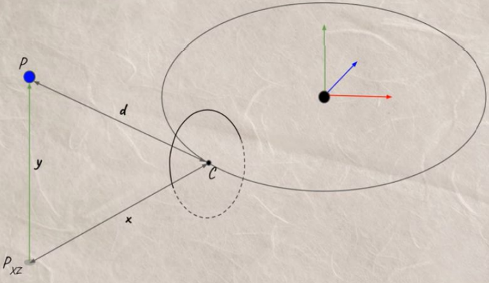
```
float df_Torus( vec3 rayPos, vec3 pos, float rad)
    {
    pos = rayPos - pos;
    vec2 radius = vec2(rad, rad*0.3);
    vec2 q = vec2(length(pos.xz)-radius.x,pos.y);
    float dist = length(q)-radius.y;
    return dist;
}

```
Prima calcolo il vettore tra la punta del raggio e il centro della figura. 
Genero un vettore di float in cui memorizzo il valore dei due raggi, cioè quello esterno e quello più piccolo che definisce il tubo. 
Genero il vettore `q` come la distanza dei componenti xy della punta del raggio e il raggio della figura, e il componente y della posizione della figura. 
La distanza quindi è la dimensione del vettore `q` meno il raggio del tubo del toro.


## Operatori
Le funzioni degli operatori lavorano sulle distanze delle superfici ed elaborano la distanza finale.
### Unione
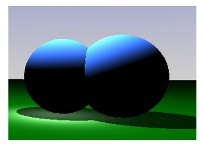
```
float opUnion( float d1, float d2 )
    min(d1,d2); 
```
Si tratta dell'operatore più semplice, restituisce il valore più piccolo delle due distanze. 

### Sottrazione
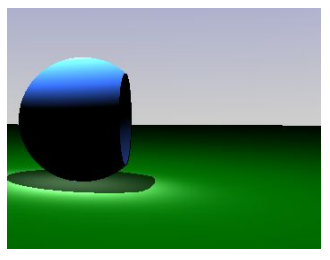
```
float opSub( float d1, float d2 )
    max(-d1,d2);
```
**Come funziona**: Ipotizzando che d1 sia A e d2 sia B
Nel primo step il raggio è fuori da A e fuori da B, tra le due distanze il maggiore è B, perchè ci sono due distanze positive di cui una posta al negativo (A), il raggio avanza fino alla superficie di B.

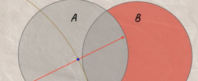

Il raggio è dentro A, ma ancora fuori da B(molto vicino alla superficie), significa che il valore negativo di A diventa positivo (è già meno perchè è stato applicata la sottrazione del raggio della sfera) ed è più grande di B. Il prossimo step avanza del valore di distanza -A

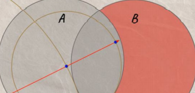

Dato che la distanza che mi serve deve avere precisione 0.01, il valore ritornato non è ancora sufficiente, quindi il prossimo step implica un nuovo avanzamento di distanza posizione - centro di A (perchè A è più vicino). 
Il raggio avanza ancora perchè la distanza ritornata dalla funzione è ancora più grande di 0.01 (precisione di default).

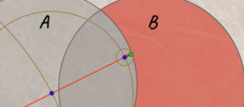

Ultimo passaggio: il raggio è dentro A e dentro B, attenzione, B non è negato, quindi da quando il raggio è entrato dentro la figura di B il suo valore sarà sempre negativo. Dato che si è avanzato di A, ora anche se è 0.01, è il valore più grande dei due e viene restituita la minima precisione raggiunta.

### Intersezione
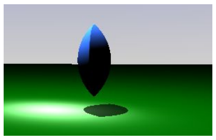
```
float opIntersect( float d1, float d2 )
    max(d1,d2);
```
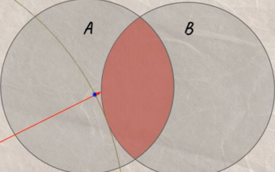

Nel primo step, si prende la distanza più lontana, cioè B e si raggiunge il suo bordo. 
Ora si è dentro A e fuori da B

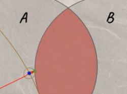

Si è raggiunta una distanza accettabile per la precisione e si ferma il raymarching. 
Quindi con il raggio fuori da A AND B, la distanza maggiore è quella della figura più lontana
Con il raggio dentro A OR B, la distanza maggiore è quella della figura all'esterno. 

### Smooth
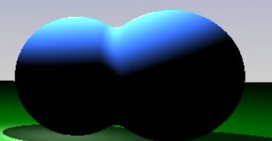 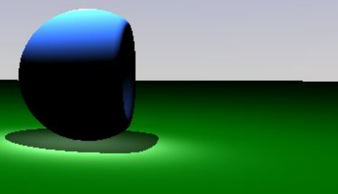 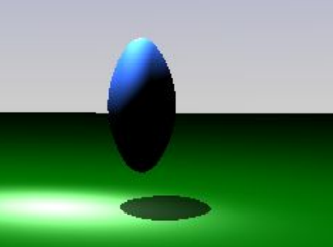
```
float opSmoothUnion(float d1, float d2, float k )
{
    float h = clamp( 0.5 + 0.5*(d2-d1)/k, 0.0, 1.0 );
    return mix( d2, d1, h ) - k*h*(1.0-h); 
}

float opSmoothSub( float d1, float d2, float k ) 
{
    float h = clamp( 0.5 - 0.5*(d2+d1)/k, 0.0, 1.0 );
    return mix( d2, -d1, h ) + k*h*(1.0-h); 
}

float opSmoothIntersection( float d1, float d2, float k ) 
{
    float h = clamp( 0.5 - 0.5*(d2-d1)/k, 0.0, 1.0 );
    return mix( d2, d1, h ) + k*h*(1.0-h); 
}
```
Sono gli stessi operatori, ma con l'interpolazione polinomiale.

### Altre azioni sulle figure
* Rotazione
```
float3 Rotation(float3 ray, float4 rotation_vector) {
    float a = rotation_vector.w; 
    float s = sin(a);
    float c = cos(a);
    float2x2 rotation_mat = float2x2(c, -s, s, c);

    ray.xy = mul(ray.xy, rotation_mat); 
    return ray; 
}

...
float3 p = raypos; 
p = p - _positions[i]; //traslation
p = Rotation(p, _rotations[i]); //rotation

df_Sphere(p, _size[i]);
...

```
Per ruotare una figura nella scena non devo agire sulla figura stessa, ma sul "punto di vista" della figura, infatti è necessario ruotare il raggio in modo da cambiare il punto di vista del raymarching in fase di calcolo. 

Per ottenere una rotazione in locale sull'oggetto prima si trasla, cioè si ottiene la posizione dell'oggetto, poi ruota.
L'operazione contraria provocherebbe la rotazione e traslazione, quindi uno spostamento nello spazio. 

* Evidenziare le figure
```
float border = dot(normalize(cameraPosition - p), n);
if (border > -0.3 && border < 0.3)
        return float3(1.0,1.0,1.0);
```
Viene fatto il dot product tra direzione del vettore punto - Ray Origin e il vettore normale del punto sulla superficie, se è un valore tra -0.3 e 0.3, lo interpreto come un bordo e lo uso per identificare la parte da colorare di bianco.

* Blend Color
```
color += max(0.0, 1.0 - ShapeDistance(raypos, i).dist) * _colors[i] * 1.0;
```
Per capire di che colore deve essere il punto da rappresentare, cerco la distanza di quel punto da ogni figura presente nella scena. 
Per ogni figura controllo quanto questa è vicina, se è molto vicina `1.0 - distanza` darà un valore molto vicino all'1, quindi moltiplico questo valore per il colore di quella figura vicina (1 * colore implica un colore pieno), quindi questo processo mi serve per misurare quanto una figura contibuisce al colore di quel punto. 

Per i punti più lontani 1 - un valore alto, restituisce un valore minore di zero, quindi non fornisce contributo di colore su quel punto. Infine viene fatto un clamp per evitare che un colore con numeri negativi influenzi il colore finale. 

